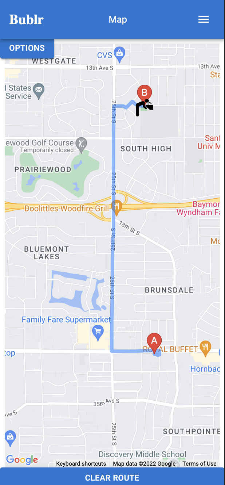

# Bublr

## Description

_Duration: 2 weeks_

Bublr is a mobile first web application meant to serve all of your drinking fountain needs. Bublr helps you find drinking fountain locations near you so you do not go thirsty again. Offering more than just routes to fountains, Bublr also provides a fun fountain rating system with reviews and comments that can provide useful information on each fountain. Useful information can include if the fountain is closed for the winter, quality, environment around the fountain, and so on. 

## Preview
 

### Home Page
---

### Navigation Bar
---

### Fountains Page
---

### Fountain Item View
---

### Fountain Map
---

### Fountain Map Routing
---

### Administrative Add Fountain Page
---

---
## Prerequisites

- [node js](https://nodejs.org/en/)
- [npm](https://docs.npmjs.com/)
- [PostrgeSQL](https://www.postgresql.org/)
- [Nodemon](https://nodemon.io/)

You must also get an API key from the Google Maps Platform:
- [Google Maps Platform](https://console.cloud.google.com/google/maps-apis)

## Built With

- [React](https://reactjs.org/)
- [React-Redux](https://react-redux.js.org/)
- [Material UI](https://mui.com/)
- [@react-google-maps/api](https://react-google-maps-api-docs.netlify.app/)

## Acknowledgement
Thanks to [Emerging Digital Academy](https://emergingacademy.org/) for supplying me with the resources to complete this project.

## Support
If you have any questions, suggestions, or issues, please email me at [david.wesley.lindberg@gmail.com](www.google.com)